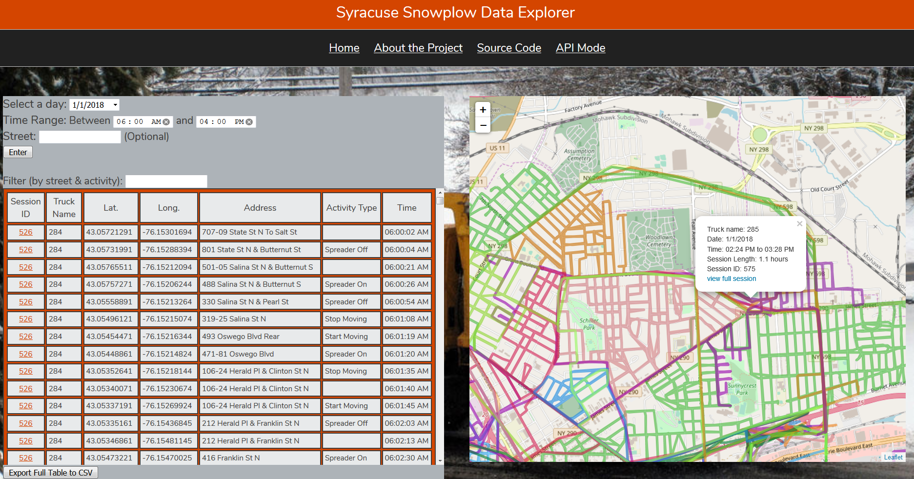

### Syracuse Snowplow Data Explorer

##### A Python 3 web app for exploring snowplow GPS data in Syracuse, NY
###### by Michael G. Phillips, March 2018

### Edit:

This project placed 2nd ($2,000) in the *Plowing through the Data* Hackathon! 

News Articles: 
* [iSchool News](https://ischool.syr.edu/articles/news/view/winners-of-plowing-through-the-data-hackathon-announced/)
* [syracuse.com](http://www.syracuse.com/news/index.ssf/2018/03/syracuse_university_civic_hackathon_winners_announced.html)
* [Syracuse University News](https://news.syr.edu/2018/03/winners-of-plowing-through-the-data-hackathon-announced/)

The following project is my submission for the Syracuse "Plowing Through the Data" hackathon, which encourages
the community to make interesting tools to explore our city's snow plow data, so that we can better understand 
how our plows accomplish their tremendous task of snow removal from the streets of Syracuse. 

This project is meant to be the ultimate data exploration tool, with the main goal of allowing users to easily visualize and understand
the snowplow GPS tracker data.

With this app, you can:

* Identify which trucks plowed which neighborhoods at which time
* View full truck shifts in isolation
* Visually identify unplowed neighborhoods and trucks in the nearby area
* View the plow data as map plots and tabular output
* Filter your search further by street name and plow activity
* Easily reset the database with your own parameters and preprocessing
* Retrieve the raw data of your searches in an API mode, which can be incorporated into other apps
* Export tabular output as CSV files

#### Installation

The program runs as a Python (Flask) web app. As such, the following needs to be in order:

* Install Python (3.5+) (and ensure it is on your path)
* Install the requirements ([Flask](http://flask.pocoo.org/), 
                             [folium](https://github.com/python-visualization/folium), 
                             [dateutil](https://dateutil.readthedocs.io/en/stable/)) 
by navigating to the project directory in the terminal and typing 

      python -m pip install -r requirements.txt
      
* run the main app file (`main.py`) by typing `python main.py` in the terminal (in the project directory) 
(or run `main.py` from an IDE)

The program should now be running locally at `http://127.0.0.1:5000/` -- open any web browser to view. See the "about" page
for usage instructions and examples.

A copy of the project also runs for free at [http://mgphilli.pythonanywhere.com](http://mgphilli.pythonanywhere.com).
